```
//|  ===============  |
//|  |     THE     |  |
//|  POCKET HANDBOOK  |
//|OF IMAGE PROCESSING|
//|  ALGORITHMS IN C  |
//|  |             |  |
```

[Processing](https://processing.org/) demos made when reading the book [*The Pocket Handbook of Image Processing Algorithms in C* (Harley R. Myler & Arthur R. Weeks)](http://adaptiveart.eecs.umich.edu/2011/wp-content/uploads/2011/09/The-pocket-handbook-of-image-processing-algorithms-in-C.pdf).

Featuring:

- C listings in the book ported to Processing.
- Each algorithm is a standalone Processing sketch with no inter-dependency.
- Each sketch includes a usage example. 
- Bugs in the book are fixed, and explained in the header comments.
- Other notes/thoughts about the algorithms/implementations are also included in header comments.
- The original "C89" flavour is preserved.
- Each sketch folder includes a `preview.png` to show what to expect without running the sketch.

Some trivial topics (e.g. flipping an image) are currently being skipped, but may occur as part of the code for another algorithm.

A work in progress.

Thanks to @golanlevin for gifting me with the (physical) book :)


| | |
|---|---|
| [](./AdaptiveDWMTM) | [](./AdaptiveMMSE) |
| [AdaptiveDWMTM](./AdaptiveDWMTM) | [AdaptiveMMSE](./AdaptiveMMSE) |
| [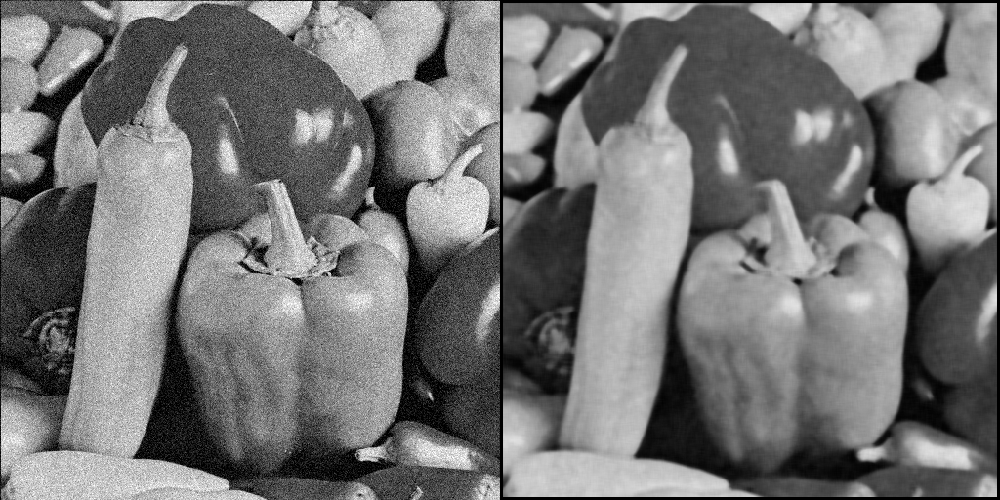](./AlphaMeanFilter) | [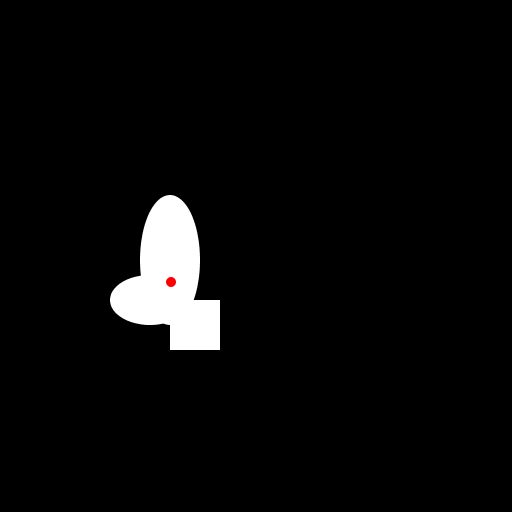](./Centroid) |
| [AlphaMeanFilter](./AlphaMeanFilter) | [Centroid](./Centroid) |
| [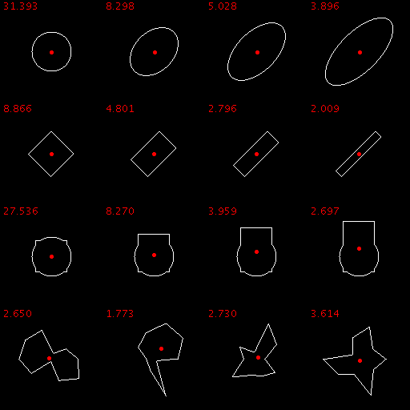](./Circularity) | [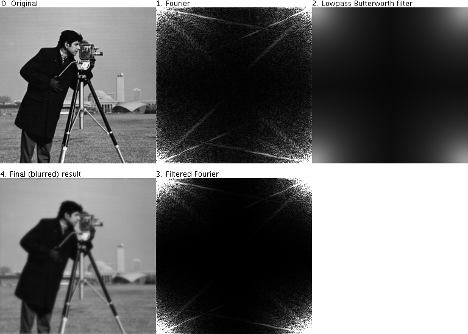](./CircularlySymmetricFilter) |
| [Circularity](./Circularity) | [CircularlySymmetricFilter](./CircularlySymmetricFilter) |
| [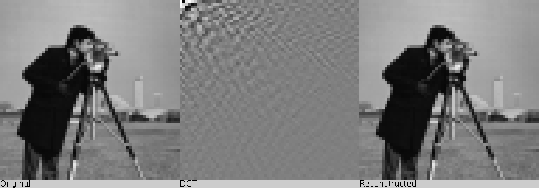](./DiscreteCosineTransform) | [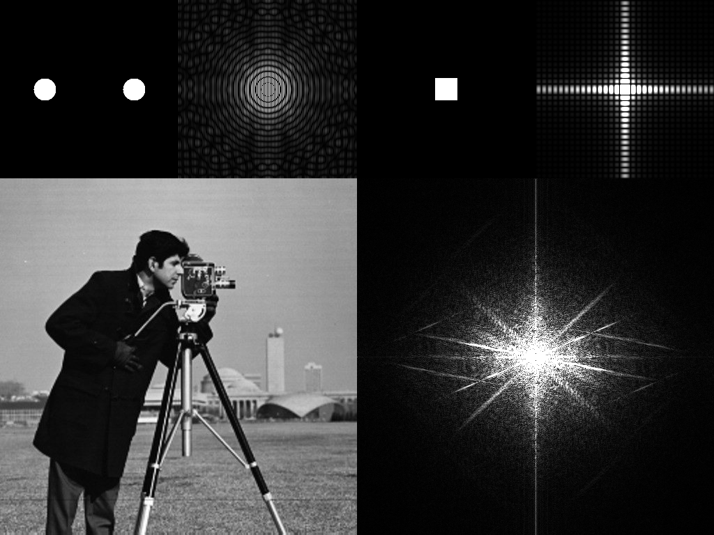](./DiscreteFourierTransform) |
| [DiscreteCosineTransform](./DiscreteCosineTransform) | [DiscreteFourierTransform](./DiscreteFourierTransform) |
| [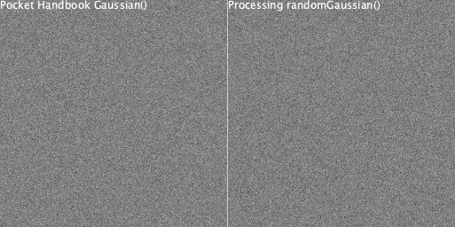](./GaussianNoise) | [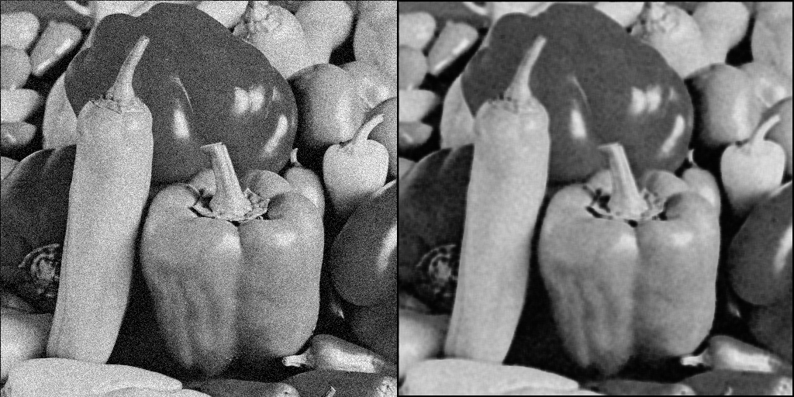](./GeometricMeanFilter) |
| [GaussianNoise](./GaussianNoise) | [GeometricMeanFilter](./GeometricMeanFilter) |
| [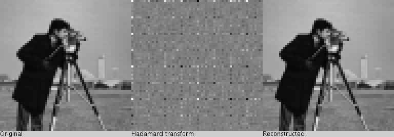](./HadamardTransform) | [](./HarmonicMeanFilter) |
| [HadamardTransform](./HadamardTransform) | [HarmonicMeanFilter](./HarmonicMeanFilter) |
| [](./HartleyTransform) | [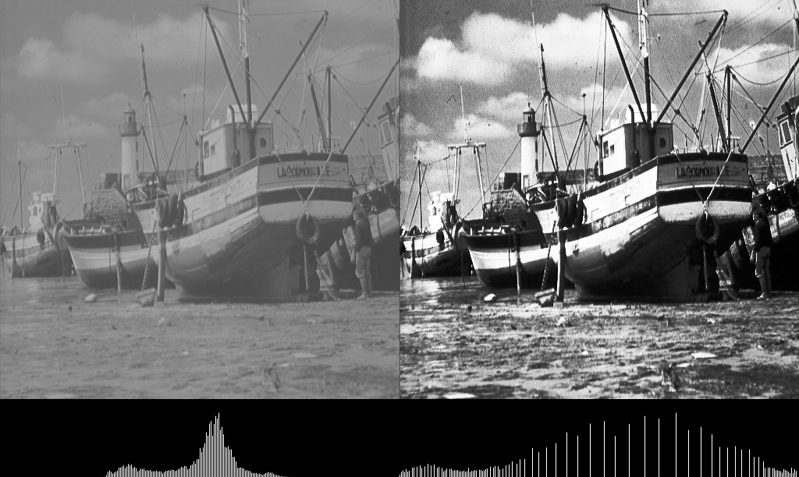](./HistogramEqualization) |
| [HartleyTransform](./HartleyTransform) | [HistogramEqualization](./HistogramEqualization) |
| [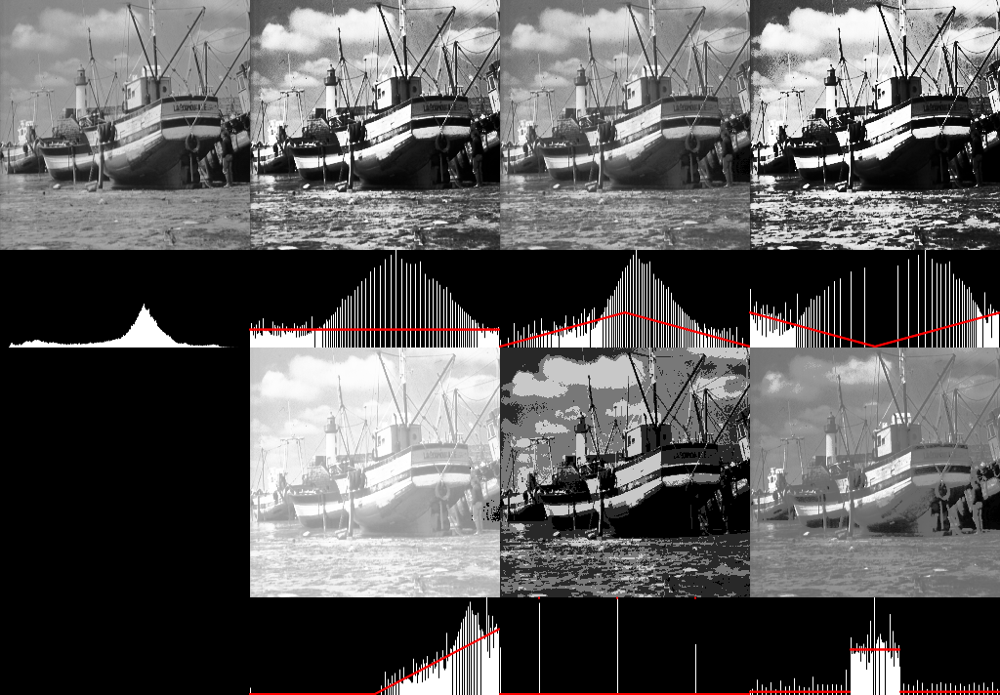](./HistogramSpecification) | [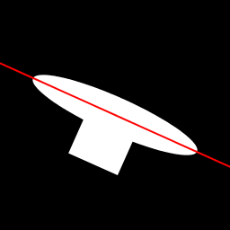](./MaximumAxis) |
| [HistogramSpecification](./HistogramSpecification) | [MaximumAxis](./MaximumAxis) |
| [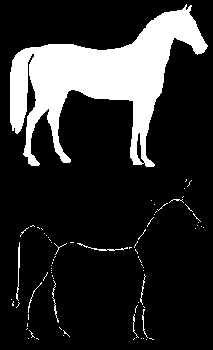](./Skeleton) | [](./Thickening) |
| [Skeleton](./Skeleton) | [Thickening](./Thickening) |
| [](./Thinning) | [](./TopHatFilter) |
| [Thinning](./Thinning) | [TopHatFilter](./TopHatFilter) |
| [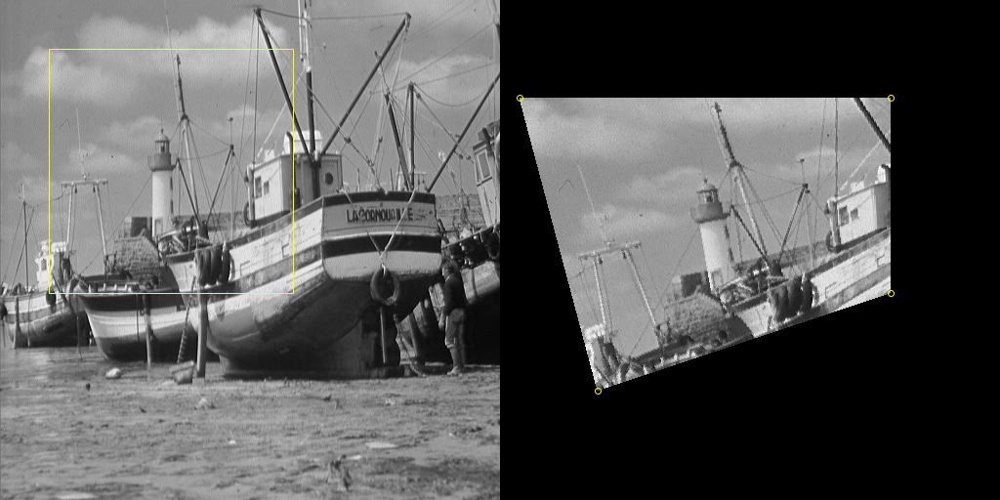](./Warping) |
| [Warping](./Warping) |